# Uma-An-lise-Mais-Detalhada-da-Estrutura-da-Internet

#### Borda da Rede:
- Hosts/sistemas finais: clientes e servidores.
- Servidores: em Data Centers ou na Nuvem.

Serve para os dispositivos finais, como: Celulares, computadores se conectarem.

#### Redes de acesso, meio físico:
- Links de comunicação com fio ou sem fio (Wireless).

#### Núcleo da Rede (Core)
- Roteadores e Switches conectados.
- Redes de redes.

#### Como conectar os dispositvos finais ao roteador de borda?
- Redes de acesso residenciais
- Redes de acesso institucionais (faculdade, empresas)
- Redes de acesso móvel (Wi-Fi, 4G/5G)

#### O que procurar: 
- Taxa de transmissão (bits por segundo) 
- Mbps - bits X MBps - byte
- Acesso dedicado ou compartilhado entre os usuários.

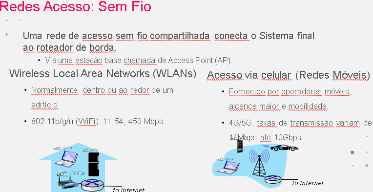

#### Hosts: Enviam Pacotes de Dados

##### Função de envio de host:
- Recebe mensagem do aplicativo (APP).
- Divide em pedaços menores, conhecidos como pacotes, de comprimento L bits.
- Transmite pacotes para a rede de acesso na taxa de transmissão R.
- Taxa de transmissão do link, também conhecida como capacidade do link ou como largura de banda do link.

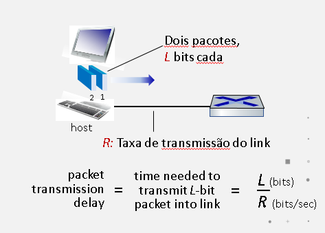

#### Modelo OSI

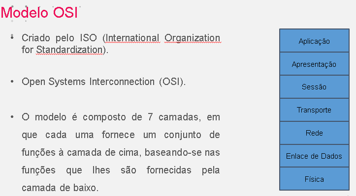

Criação de um modelo padronizado, internacionalmente, de protocolos de comunicação entre sistemas abertos.

#### Camada de Aplicação

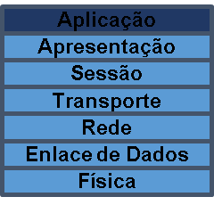

- A camada de aplicação é responsável por prover serviços para aplicações de modo a abstrair a existência de comunicação em rede entre processos de diferentes computadores. 

- A camada de aplicação é responsável pela interação host-usuário.

#### Camada de Aplicação

- É responsável também por identificar e estabelecer a disponibilidade da aplicação na máquina destinatária e disponibilizar os recursos para que tal comunicação aconteça.

- Por exemplo, ao solicitar a recepção de e-mail através do aplicativo de e-mail, este entrará em contato com a camada de Aplicação do protocolo de rede efetuando tal solicitação.

#### Camada de Apresentação

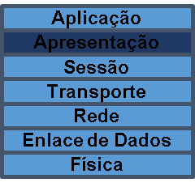

- A camada de Apresentação, também chamada camada de Tradução, converte o formato do dado recebido pela camada de Aplicação em um formato comum a ser usado na transmissão desse dado.

- Um exemplo comum é a conversão do padrão de caracteres (código de página) quando o dispositivo transmissor usa um padrão diferente do ASCII. 

- Pode ter outros usos, como compressão de dados e criptografia.

- Ela trabalha transformando os dados em um formato no qual as camadas de aplicação adjacentes possam aceitar.

#### Camada de Sessão

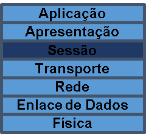

- A camada de sessão estabelece, gerencia e termina sessões entre aplicações.

- As sessões consistem no diálogo entre duas ou mais entidades de apresentação.

- Esta camada sincroniza o diálogo entre entidades da camada de apresentação e gerencia a troca de dados entre as mesmas.

- Conceitos importantes dessa camada: simplex, half-duplex e full-duplex.

#### Camada de Transporte

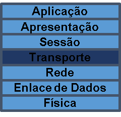

- A camada de transporte é responsável por usar os dados enviados pela camada de Sessão e dividi-los em segmentos que serão transmitidos para a camada de Rede. 

- Isso inclui controle de fluxo, ordenação dos pacotes e a correção de erros, tipicamente enviando para o transmissor uma informação de recebimento, informando que o pacote foi recebido com sucesso.

- A camada de Transporte separa as camadas de nível de aplicação (camadas 5 a 7) das camadas de nível físico (camadas de 1 a 3). 

- A camada de Transporte, faz a ligação entre esses dois grupos e determina a classe de serviço necessária como orientada a conexão e com controle de erro e serviço de confirmação ou sem conexões e nem confiabilidade.

#### Camada de Rede

- A camada de rede do modelo OSI é responsável por controlar a operação da rede de um modo geral. Suas principais funções são o roteamento dos pacotes entre fonte e destino.

- Mesmo que estes tenham que passar por diversos nós intermediários durante o percurso e o controle de congestionamento.

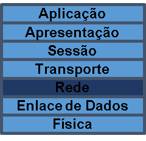

- Permite a compatibilidade na interconexão de sub-redes entre si, porque podem ser heterogêneas, por exemplo Point-to-Point (PPP) e Ethernet. 

- Esta camada provê também o endereçamento lógico, que permite identificar dois sistemas distintos em redes lógicas diferentes.

#### Camada de Enlace

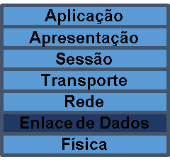

- A camada de enlace provê o transporte confiável de dados através de meio físico e fornece um endereço físico para os dispositivos.

- Esta camada detecta e, opcionalmente, corrige erros que possam acontecer no nível físico. É responsável pela transmissão e recepção (delimitação) de quadros e pelo controle de fluxo.

- Controle de Link Lógico (LLC) especifica os mecanismos para endereçamento de estações conectadas ao meio e para controlar a troca de dados entre usuários da rede. 

- Controle de Acesso ao Meio (MAC) é provedora de acesso a um canal de comunicação e o endereçamento neste canal possibilitando a conexão de diversos computadores numa rede.

- O endereçamento é realizado pelo endereço Media Access Control (MAC) ou também chamado endereço físico que consiste em um número único a cada dispositivo de rede possibilitando o envio de pacotes para um destino especificado. Atua como interface entre a Link Logical Control (LLC) e a camada física.

#### Camada Física

- O nível físico tem a função de transmitir uma sequência de bits através de um canal de comunicação. 

- As funções típicas dos protocolos deste nível são fazer com que um bit "1" transmitido por uma estação seja entendido pelo receptor como bit "1" e não como bit “0.

###### Assim, este nível trabalha basicamente com as características mecânicas e elétricas do meio físico, como por exemplo:
 - Número de volts que devem representar os níveis lógicos "1" e "0"; 

 - Velocidade máxima da transmissão; 

 - Número de pinos do conector e utilidade de cada um; 

 - Diâmetro dos condutores.

 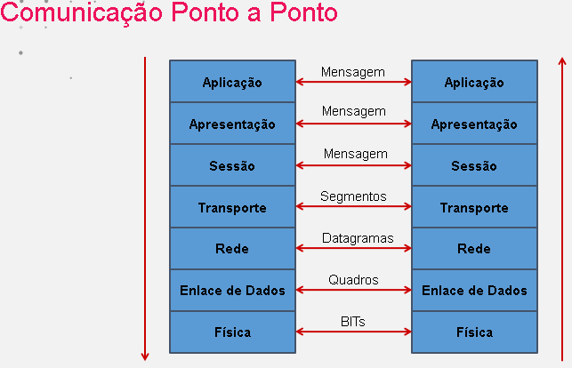

#### Modelo TCP/IP

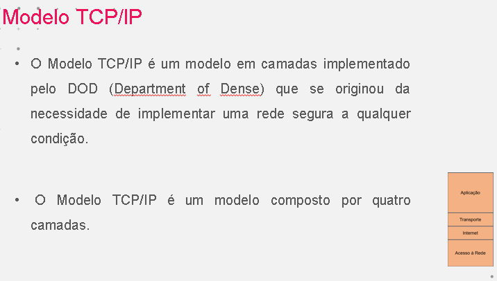

- Aplicação: fornece serviços de redes para aplicativos, é responsável pela representação de dados e estabelece, gerencia e encerra uma sessão;
 - Transporte : responsável pela comunicação fim-a-fim;
 - Internet: endereçamento e determinação do melhor caminho;
 - Acesso à Rede: fornece acesso aos meios e transmissão binária.

#### Comparação entre os Modelos

 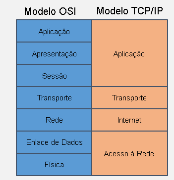

##### notas

###### O TCP/IP combina os aspectos das camadas de apresentação e de sessão dentro da sua camada de aplicação.

 - O TCP/IP combina as camadas física e de enlace do OSI na camada de acesso à rede.

 - O TCP/IP parece ser mais simples por ter menos camadas.

 - Os protocolos TCP/IP são os padrões em torno dos quais a Internet se desenvolveu, portanto o modelo TCP/IP ganha credibilidade apenas por causa dos seus protocolos.

 - Os protocolos do Modelo OSI não são comumente utilizados, sendo que atualmente, o Modelo OSI é apenas utilizado como um guia .

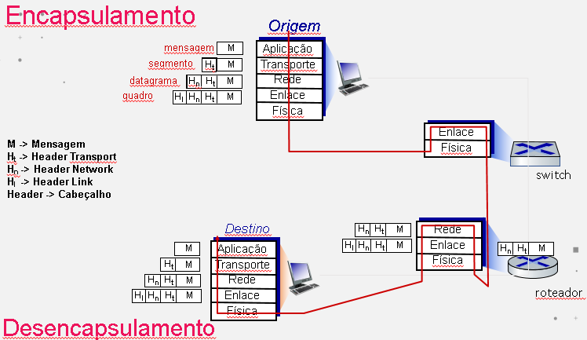

#### Wireshark

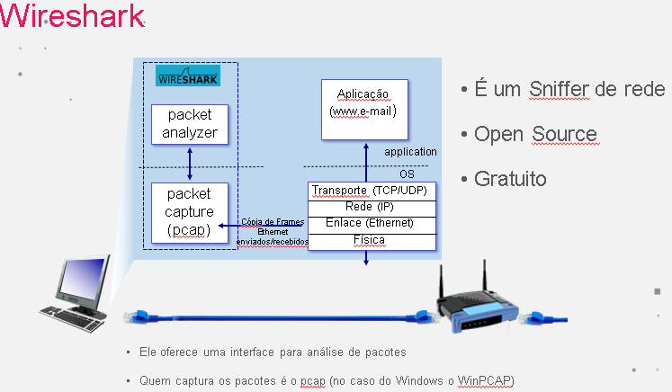
